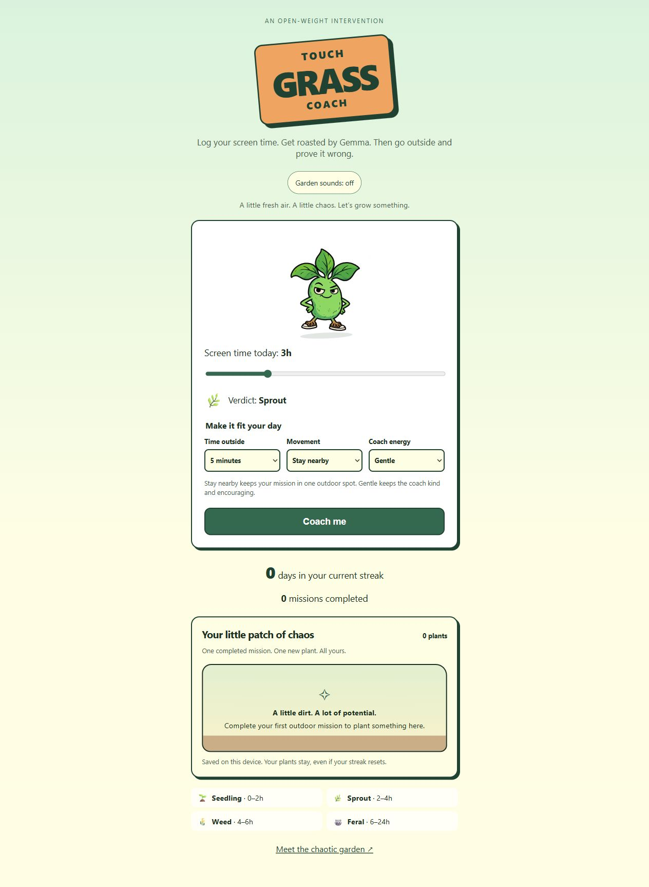
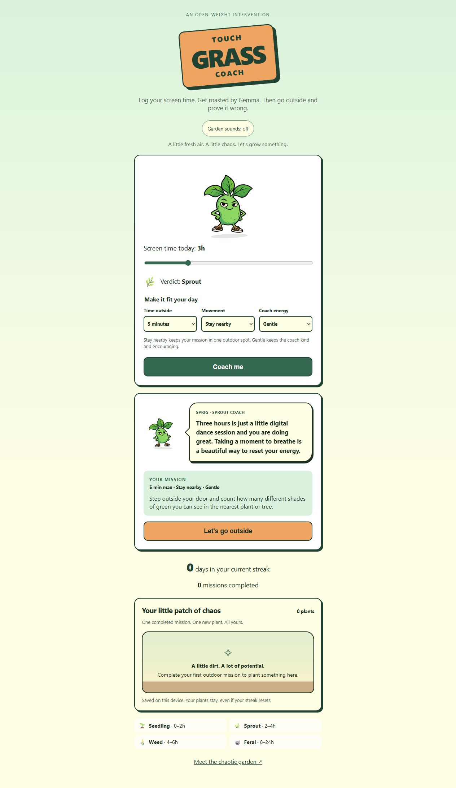
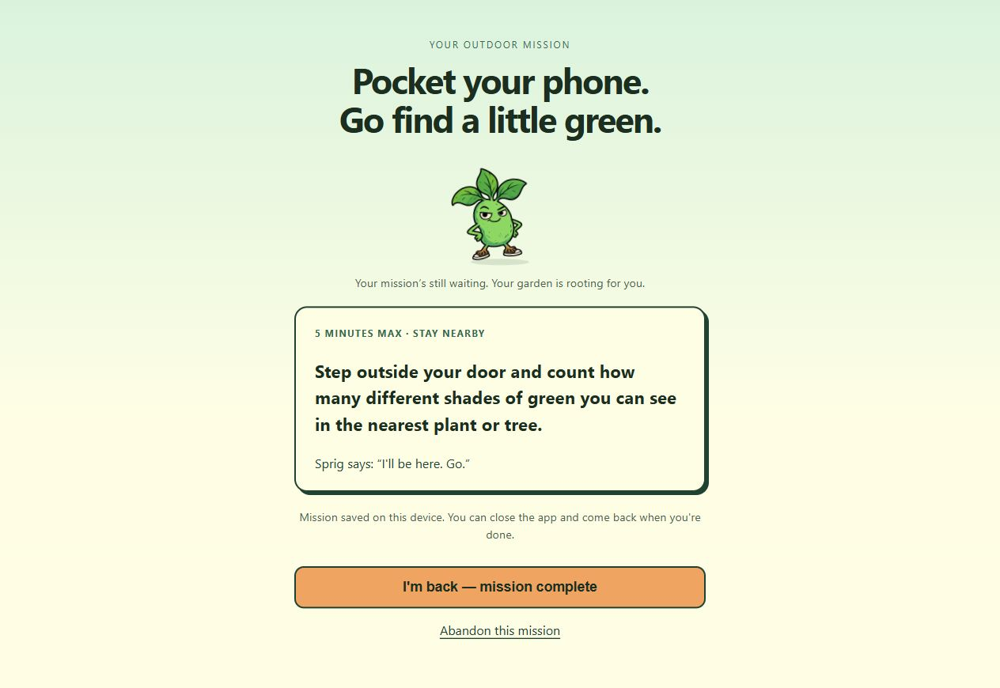
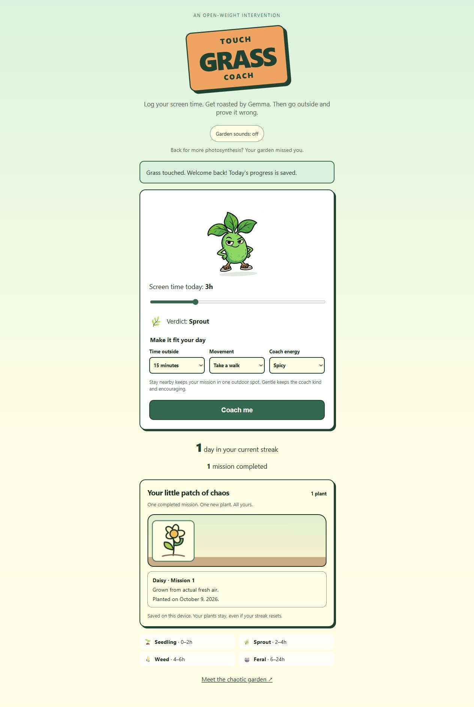
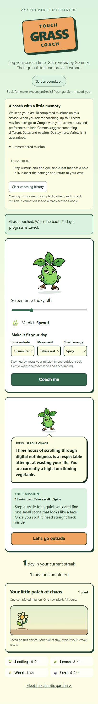

# A short walkthrough

This captures the deployed app using a real Gemma response. Completion is demonstrated immediately to show the UI; no outdoor activity or elapsed five-minute trial is claimed.

## 1. Make the mission fit

Choose five minutes, stay nearby, and gentle coaching. Sound begins off.

## 2. Get one concrete mission

Gemma responds to the selected preferences. Read the mission, then choose “Let's go outside.”

## 3. Pocket the phone

The task is saved on the device before the outside view appears. Reloading restores the same task without another model request.

## 4. Return to a growing garden

Completing the task credits one mission and one plant. The new plant can reveal a personality note and its completion date. A reload retains the reward without replaying the celebration.

## 5. A coach with memory

The merged memory feature keeps ten completed missions locally and sends at most the latest three mission texts to Google when you request coaching. Inspect the history or clear it without resetting the garden, streak, or current mission. Dates and IDs stay local. Repeats are discouraged, not mechanically prevented.

This additional screenshot was captured from the locally verified PR #10 build. The first four screenshots document the earlier public release; check the live deployment before recording or publishing a fresh walkthrough.

## Optional video narration

“Touch Grass Coach turns a screen-time confession into one outdoor mission. Choose how long you have, how you want to move, and the coach's energy. Gemma writes a short response and a concrete activity. Let's go outside saves the task, so you can pocket the phone and reopen it later. When you return, completion grows one plant in your chaotic garden. Your plants stay even if your streak resets. Sound is optional. The model supplies the personality; ordinary code makes sure progress is credited once. The point is to spend less time here, and more time outside.”

Add: “The coach remembers a few completed tasks to encourage variety. Only three recent mission texts go to Google, and you can clear that history without losing your plants.”

For a recorded version, capture these screens, briefly show the memory disclosure, and clearly label any time jump. Use your own outdoor footage only after actually doing the mission. The challenge accepts the live demo link without a video.
